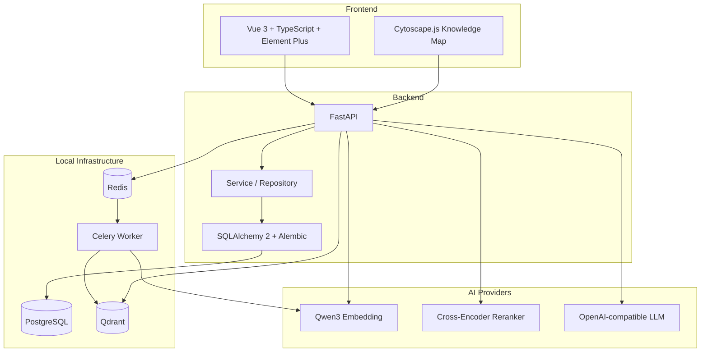
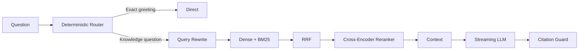

# TraceMind

**一个本地优先、可追溯、面向长期学习与技术积累的个人 AI 知识库。**

TraceMind 将资料导入、Hybrid Retrieval、Streaming RAG、Citation、Conversation 与知识沉淀连接成完整的个人学习闭环。它不试图成为通用聊天机器人，而是帮助你理解自己的资料、核验回答来源，并把重要问题与解决经验持续保存下来。

> **Daily usefulness over feature completeness.**
>
> 日常价值优先于功能数量。


[](LICENSE)

## 为什么做 TraceMind

长期学习 RAG、AI、后端与工程技术时，资料常散落在 PDF、Markdown、代码片段和历史对话中。TraceMind 希望提供一条可重复的学习路径：

- 快速理解自己的资料；
- 检查 AI 回答究竟来自哪里；
- 将问题、根因、方案和验证结果沉淀为知识；
- 让知识资产随真实使用持续增长。

## 核心工作流

```mermaid
flowchart LR
    A["PDF / DOCX / Markdown / TXT / Code"] --> B["Parse & Chunk"]
    B --> C["Embedding & Index"]
    C --> D["Query"]
    D --> E["Dense + BM25"]
    E --> F["RRF"]
    F --> G["Cross-Encoder Reranker"]
    G --> H["Streaming LLM"]
    H --> I["Citation Guard"]
    I --> J["Conversation"]
    J --> K["KnowledgeEntry"]
    K --> L["Knowledge Map"]
```



## 产品界面

以下位置预留给基于公开 demo 数据拍摄的真实界面截图。截图完成后放入 `docs/images/`，再取消对应 Markdown 图片行的注释。

<!--
### Conversation — Streaming Answer / Pipeline Trace / Citation Evidence


### Documents — Upload / Parse / Index / Ready


### Knowledge — KnowledgeEntry / Evidence Snapshot


### Knowledge Map — Nodes / Edges / Inspector

-->

## 核心能力

### 1. 文档处理

- 支持 PDF 文本层、DOCX、Markdown、UTF-8 TXT，以及 Java、JSP、JavaScript、TypeScript、Vue、SQL、Python 等通用技术代码文件；
- 支持普通多文件上传，每个文件独立解析与索引；
- 展示真实上传字节进度，以及 Parse、Index、Ready 状态和 elapsed time；
- 通过 SHA-256 管理重复内容与 DocumentVersion 历史版本；
- Chunk 保留文档名、相对路径、章节、页码或代码行范围等可追溯元数据。

### 2. Hybrid Retrieval

- Qwen3 Embedding 生成 Dense vector；
- Qdrant 服务端 BM25 提供 Sparse retrieval；
- Reciprocal Rank Fusion（RRF）合并 Dense 与 BM25 排名；
- 可选 Qwen3 Cross-Encoder Reranker 进行二阶段重排，服务不可用时安全回退 Hybrid；
- Query Rewrite 支持结合有限会话历史改写检索问题；
- Path Scope 可将查询精确限制到指定文档路径。

### 3. 可追溯问答

- 确定性 Direct / RAG Router：仅完整匹配的简单寒暄绕过检索；
- Server-Sent Events（SSE）流式回答；
- 实时 Pipeline Trace 展示路由、改写、检索、重排与 LLM 阶段；
- Citation Guard 只允许回答引用真实返回的 Source identity；
- Evidence Inspector 展示被引用的文档内容、章节、页码或代码行；
- Conversation 持久化历史消息，支持完成、取消与错误状态。

### 4. 知识沉淀

- 将 completed assistant answer 保存为 KnowledgeEntry；
- 结构化保存 Question、Background、Root Cause、Solution 与 Failed Attempts；
- 支持 Tags 与 `unverified` / `verified` / `outdated` 验证状态；
- 保存 Question、Answer、Evidence 与生成元数据的安全快照；
- 原 Conversation 仍存在时可以回溯，删除后快照继续保留。

### 5. Knowledge Map

- 根据当前 PostgreSQL 数据实时派生，不持久化图数据；
- 节点包含 Knowledge Base、Document、KnowledgeEntry 与派生 Tag；
- 关系包含 `contains`、`cites`、`tagged` 与透明规则生成的 `related`；
- `related` 只来自 shared tag 或 shared live cited document；
- 前端使用 Cytoscape.js 提供 zoom、pan、drag、filter、Fit Graph 与 Inspector；
- 不使用 Graph DB，也不是 GraphRAG。

## 系统架构



### Retrieval Pipeline



## Retrieval Evaluation

v1.0 使用固定 synthetic corpus、固定 24-case dataset、固定 baseline 与 isolated Qdrant collection 运行回归门禁。该评测用于发现同一实现上的检索回归，不代表所有真实资料的通用效果。

| Metric | v1.0 |
|---|---:|
| Cases / Answerable | 24 / 22 |
| Hit@1 | 0.5909 |
| Hit@5 | 1.0000 |
| Recall@5 | 0.8409 |
| MRR@5 | 0.7424 |
| nDCG@5 | 0.6623 |
| All-required@5 | 0.8182 |
| P50 / P95 | 3016 ms / 3587 ms |
| Regression gate | **PASS** |

评测资产、指标定义、隔离要求与运行命令见 [固定 Retrieval Evaluation](docs/retrieval-evaluation/README.md)。

## Quick Start

### 前置条件

- Git
- Python 3.12
- [uv](https://docs.astral.sh/uv/)
- Node.js 22.18+（或 24.12+）与 npm
- Docker Desktop，或支持 Docker Compose 的 Docker Engine

### 1. Clone 与环境变量

```bash
git clone https://github.com/485524097/TraceMind.git
cd TraceMind
```

Windows PowerShell：

```powershell
Copy-Item .env.example .env
Copy-Item frontend/.env.example frontend/.env
```

macOS / Linux：

```bash
cp .env.example .env
cp frontend/.env.example frontend/.env
```

打开 `.env`，至少填写 `LLM_BASE_URL` 与 `LLM_MODEL`；远程服务需要凭据时再填写 `LLM_API_KEY`。不要提交 `.env`。

### 2. PostgreSQL、Redis 与 Qdrant

在仓库根目录运行：

```bash
docker compose up -d postgres redis qdrant
docker compose ps
```

### 3. Backend 与 migration

```bash
cd backend
uv sync --frozen
uv run alembic upgrade head
uv run uvicorn app.main:app --reload
```

Backend 默认位于 `http://localhost:8000`，Swagger 位于 `http://localhost:8000/docs`。

### 4. Celery Worker

在第二个终端的 `backend` 目录运行：

```bash
uv run --no-sync celery -A app.worker.celery_app:celery_app worker --loglevel=INFO
```

Windows 本地 CPU 模型如需让小文档与大文档并行，可使用已验证的单模型进程配置：

```powershell
uv run --no-sync celery -A app.worker.celery_app:celery_app worker --loglevel=INFO --pool=threads --concurrency=2 --prefetch-multiplier=1
```

### 5. 可选本地 Reranker

默认 `RERANKER_ENABLED=false`，不启动 Reranker 也可以使用 Hybrid Retrieval。启用时，先根据设备和模型缓存调整 `.env`，再在 `backend` 目录启动单 worker 服务：

```bash
uv run --no-sync uvicorn app.reranker_server:app --host 127.0.0.1 --port 8011 --workers 1
```

确认 `http://127.0.0.1:8011/health/ready` 返回 200 后，将 `.env` 中的 `RERANKER_ENABLED` 设为 `true` 并重启 Backend。CPU / CUDA、离线缓存与显存边界见 [Reranker 指南](docs/reranker.md)。

### 6. Frontend

在第三个终端运行：

```bash
cd frontend
npm ci
npm run dev
```

打开 `http://localhost:5173/knowledge-bases`。更完整的开发、容器和验证流程见 [开发指南](docs/development.md)。

## Configuration

| Scope | Key variables | Notes |
|---|---|---|
| LLM | `LLM_BASE_URL`, `LLM_API_KEY`, `LLM_MODEL`, `LLM_ENABLE_THINKING` | 支持 OpenAI-compatible provider；远程调用会发送问题、必要历史与检索 Context |
| Embedding | `EMBEDDING_MODEL_NAME`, `EMBEDDING_DIMENSION`, `QUERY_EMBEDDING_DEVICE`, `INDEX_EMBEDDING_DEVICE` | 默认模型为 `Qwen/Qwen3-Embedding-0.6B` |
| Reranker | `RERANKER_ENABLED`, `RERANKER_BASE_URL`, `RERANKER_MODEL_NAME`, `RERANKER_DEVICE` | 默认模型为 `Qwen/Qwen3-Reranker-0.6B`，服务独立运行 |
| Storage | `POSTGRES_*`, `REDIS_URL`, `QDRANT_URL`, `DOCUMENT_STORAGE_ROOT` | 数据与文件默认保留在本机 |

完整变量、默认值与文件扩展名 allowlist 见 [`.env.example`](.env.example)。

## Non-goals

TraceMind v1.0 不试图成为：

- Coding Agent 或自动改代码工具；
- Git Agent；
- Multi-Agent framework；
- GraphRAG platform 或图数据库产品；
- Enterprise multi-user knowledge platform。

代码文件当前作为带 language、path 与 line range 的普通技术资料处理，不做语言 AST、Symbol Scope 或调用图。

## Project Structure

```text
backend/      FastAPI、业务分层、Celery、模型适配、migration 与测试
frontend/     Vue 3 应用、Conversation、Knowledge 与 Knowledge Map
docs/         设计、架构、评测、开发指南与 release notes
compose.yaml  PostgreSQL、Redis、Qdrant 与可选应用容器
```

## Known Limitations

- 远程 LLM provider 可能出现不可控的 TTFT 和总耗时长尾；
- 在 CPU-only 环境中，Cross-Encoder Reranker 是主要的稳定本地 RAG latency 来源；
- Knowledge Map 在内存中实时派生，目标是个人规模的知识资产，不做大图分页、聚类或缓存；
- Embedding 与 Reranker 模型首次下载或首次加载会产生明显等待，离线模式需要提前准备完整缓存；
- PDF 仅解析可提取的文本层，不包含 OCR。

## Roadmap

v1.0 后不继续按 Feature Stage 堆叠功能。后续工作由真实使用证据驱动：

- real-world usage feedback；
- bug fix；
- retrieval benchmark 与可复现 regression gate；
- 独立 Retrieval / Performance Experiment；
- 架构学习与面试准备。

详见 [Roadmap](docs/roadmap/TraceMind-Roadmap.md)。新功能应先证明真实问题、可测成功标准和最小维护成本。

## Documentation

- [v1.0 产品边界](docs/product/TraceMind-v1.md)
- [v1.0 系统架构](docs/architecture/TraceMind-Architecture.md)
- [开发指南](docs/development.md)
- [Retrieval Evaluation](docs/retrieval-evaluation/README.md)
- [v1.0.0 Release Notes](docs/releases/v1.0.0.md)

## License

TraceMind 使用 [Apache License 2.0](LICENSE)。
