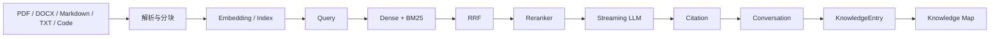

# TraceMind（持续开发中）

**一个本地优先、答案可追溯、面向长期学习与技术积累的个人 AI 知识库。**

TraceMind 用来把分散在 PDF、Markdown、技术文档、代码资料和历史对话中的信息，整理成一套**能检索、能核验、能长期沉淀**的个人知识系统。

- **快速理解**：通过混合检索找到真正相关的资料；
- **可以验证**：回答能够回溯到真实来源和检索过程；
- **长期沉淀**：把解决过的问题继续保存为结构化知识。

[](https://github.com/485524097/TraceMind/releases/latest)
[](https://github.com/485524097/TraceMind/actions/workflows/ci.yml)


[](LICENSE)

> **日常价值优先于功能数量。每一份复杂度，都应该证明自己值得存在。**

## 项目亮点

### 混合检索：不只做向量搜索

使用 Qwen3 Embedding + Qdrant BM25 + RRF（倒数排名融合）+ 可选 Cross-Encoder Reranker，兼顾语义匹配与关键词匹配；同时支持 Query Rewrite 和 Path Scope。

### 可追溯问答：不仅生成答案，还要能验证

RAG（检索增强生成）过程通过 Pipeline Trace 展示路由、改写、检索、重排与 LLM 阶段；Citation Guard 限制回答只能引用真实返回的来源，Evidence Inspector 可以继续查看文档、章节、页码或代码行。

### 知识沉淀：对话不是终点

重要回答可以保存为 `KnowledgeEntry`，继续整理 Question、Background、Root Cause、Solution、Failed Attempts、Tags、验证状态和 Evidence Snapshot，让一次问题解决真正变成长期知识资产。

### Knowledge Map：从已有知识中看到关系

根据 PostgreSQL 中已有的 Knowledge Base、Document、KnowledgeEntry 和 Tag 实时派生关系图。关系来自明确规则，用于浏览自己的知识结构；它不参与 RAG，也不是 GraphRAG。

## 快速开始

### 前置条件

- Git
- Python 3.12
- [uv](https://docs.astral.sh/uv/)
- Node.js 22.18+（或 24.12+）与 npm
- Docker Desktop，或支持 Docker Compose 的 Docker Engine

### 1. 克隆项目

```bash
git clone https://github.com/485524097/TraceMind.git
cd TraceMind
```

### 2. 准备环境变量

Windows PowerShell：

```powershell
Copy-Item .env.example .env
Copy-Item frontend/.env.example frontend/.env
```

macOS / Linux：

```bash
cp .env.example .env
cp frontend/.env.example frontend/.env
```

打开 `.env`，至少填写 `LLM_BASE_URL` 和 `LLM_MODEL`；远程服务需要凭据时再填写 `LLM_API_KEY`。不要提交 `.env`。

### 3. 启动 PostgreSQL、Redis 和 Qdrant

```bash
docker compose up -d postgres redis qdrant
docker compose ps
```

### 4. 启动后端

```bash
cd backend
uv sync --frozen
uv run alembic upgrade head
uv run uvicorn app.main:app --reload
```

- Backend：`http://localhost:8000`
- Swagger：`http://localhost:8000/docs`

### 5. 启动 Celery Worker

在第二个终端进入 `backend`：

```bash
uv run --no-sync celery -A app.worker.celery_app:celery_app worker --loglevel=INFO
```

Windows 本地 CPU Embedding 可使用项目已验证的线程配置：

```powershell
uv run --no-sync celery -A app.worker.celery_app:celery_app worker --loglevel=INFO --pool=threads --concurrency=2 --prefetch-multiplier=1
```

### 6. 启动前端

在第三个终端运行：

```bash
cd frontend
npm ci
npm run dev
```

打开 `http://localhost:5173/knowledge-bases`。

更完整的开发、容器和验证说明见 [开发指南](docs/development.md)。

<details>
<summary><strong>可选：启用本地 Reranker</strong></summary>


默认 `RERANKER_ENABLED=false`，不启动 Reranker 也可以使用 Hybrid Retrieval。

```bash
cd backend
uv run --no-sync uvicorn app.reranker_server:app --host 127.0.0.1 --port 8011 --workers 1
```

确认 `http://127.0.0.1:8011/health/ready` 返回 200 后，将 `.env` 中 `RERANKER_ENABLED` 设置为 `true` 并重启 Backend。

CPU / CUDA、离线缓存与显存边界见 [Reranker 指南](docs/reranker.md)。

</details>

## 工作流



**导入资料 → 检索 → 生成回答 → 核验来源 → 保存知识 → 持续积累。**

## 主要能力

| 能力       | 当前实现                                                     |
| ---------- | ------------------------------------------------------------ |
| 文档处理   | PDF 文本层、DOCX、Markdown、UTF-8 TXT 与常见技术代码文件；支持普通多文件上传 |
| 处理状态   | Upload、Parse、Index、Ready 状态与 elapsed time              |
| 混合检索   | Dense + BM25 + RRF + 可选 Reranker + Query Rewrite + Path Scope |
| 可追溯问答 | Direct / RAG Router、SSE（服务器发送事件）、Pipeline Trace、Citation、Evidence Inspector |
| 对话       | Conversation 持久化，支持完成、取消和错误状态                |
| 知识沉淀   | KnowledgeEntry、Tags、验证状态、Answer / Evidence Snapshot   |
| 知识关系   | 基于 PostgreSQL 实时派生 Knowledge Map                       |

代码文件在 v1.0 中作为普通技术资料处理，保留 language、path 与 line range，不做 AST、Symbol Scope 或调用图。

## 技术栈

| 层        | 技术                                                |
| --------- | --------------------------------------------------- |
| Backend   | Python 3.12、FastAPI、SQLAlchemy 2、Alembic         |
| Frontend  | Vue 3、TypeScript、Vite、Element Plus、Cytoscape.js |
| Data      | PostgreSQL、Redis、Qdrant                           |
| Worker    | Celery                                              |
| Retrieval | Qwen3 Embedding、BM25、RRF、Cross-Encoder Reranker  |
| LLM       | OpenAI-compatible provider                          |
| Deploy    | Docker Compose                                      |

## 检索评测

v1.0 使用固定 synthetic corpus、24 个固定 case、固定 baseline 和隔离 Qdrant collection 运行检索回归门禁，用于发现同一实现上的 Retrieval Regression，不代表所有真实资料上的通用效果。

| 指标               |              v1.0 |
| ------------------ | ----------------: |
| Cases / Answerable |           24 / 22 |
| Hit@1              |            0.5909 |
| Hit@5              |            1.0000 |
| Recall@5           |            0.8409 |
| MRR@5              |            0.7424 |
| nDCG@5             |            0.6623 |
| All-required@5     |            0.8182 |
| P50 / P95          | 3016 ms / 3587 ms |
| 回归门禁           |          **PASS** |

评测数据、指标定义、隔离要求与运行方式见 [Retrieval Evaluation](docs/retrieval-evaluation/README.md)。

## 关键配置

| 范围      | 关键变量                                                     |
| --------- | ------------------------------------------------------------ |
| LLM       | `LLM_BASE_URL`, `LLM_API_KEY`, `LLM_MODEL`, `LLM_ENABLE_THINKING` |
| Embedding | `EMBEDDING_MODEL_NAME`, `EMBEDDING_DIMENSION`, `QUERY_EMBEDDING_DEVICE`, `INDEX_EMBEDDING_DEVICE` |
| Reranker  | `RERANKER_ENABLED`, `RERANKER_BASE_URL`, `RERANKER_MODEL_NAME`, `RERANKER_DEVICE` |
| Storage   | `POSTGRES_*`, `REDIS_URL`, `QDRANT_URL`, `DOCUMENT_STORAGE_ROOT` |

完整变量和默认值见 [`.env.example`](.env.example)。

## 项目边界

TraceMind v1.0 不试图成为：

- Coding Agent 或自动改代码工具；
- Git Agent；
- Multi-Agent framework；
- GraphRAG platform 或图数据库产品；
- Enterprise multi-user knowledge platform。

这些边界是为了让项目继续聚焦于：**个人知识检索、答案验证和长期知识沉淀。**

## 已知限制

- 远程 OpenAI-compatible LLM 的 TTFT（首 Token 延迟）与总耗时可能出现长尾；
- CPU-only 环境中，Cross-Encoder Reranker 会成为明显的本地 RAG 延迟来源；
- Knowledge Map 面向个人数据规模，不提供大图分页、聚类、缓存或图检索；
- Embedding 和 Reranker 首次下载或首次加载会产生明显等待，离线运行需要提前准备模型缓存；
- PDF 当前只处理可提取文本层，不提供 OCR（光学字符识别）。

## 文档

- [v1.0 产品边界](docs/product/TraceMind-v1.md)
- [v1.0 系统架构](docs/architecture/TraceMind-Architecture.md)
- [开发指南](docs/development.md)
- [Retrieval Evaluation](docs/retrieval-evaluation/README.md)
- [v1.0.0 Release Notes](docs/releases/v1.0.0.md)
- [TraceMind v1.0.0 Release](https://github.com/485524097/TraceMind/releases/tag/v1.0.0)

## 许可证

TraceMind 使用 [Apache License 2.0](LICENSE)。
